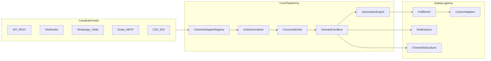

# Guía de Arquitectura — OrderUp Omnicanal B2B

## Contexto y objetivo

**OrderUp** es una plataforma B2B de automatización de pedidos y logística omnicanal construida desde cero, orientada a cualquier negocio que gestione pedidos provenientes de múltiples canales (300–600€/mes mínimo).

El valor que vendes no es "tomar pedidos", sino **absorber el caos de múltiples canales, normalizarlo, automatizar decisiones y coordinar la logística**.

El proyecto parte de cero: no hay código previo, solo este documento de arquitectura como guía.

---

## Principios arquitectónicos (no negociables)

1. **Multi-tenant desde el día 1** — cada cliente B2B es un `Organization` aislado por `organization_id` en todas las tablas.
2. **Modelo canónico de pedido** — ningún canal escribe directamente en tablas de negocio; todo pasa por normalización a un `CanonicalOrder`.
3. **Adapters desacoplados** — cada canal (API, webhook, WhatsApp, email, CSV, EDI, ERP) es un plugin que implementa la misma interfaz.
4. **Eventos de dominio** — cambios de estado (`order.received`, `order.validated`, `shipment.dispatched`) disparan automatizaciones sin acoplar módulos.
5. **Módulos por bounded context** — Orders, Channels, Logistics, Automation, Notifications, Tenants son paquetes independientes con contratos claros.
6. **API-first + audit trail** — todo lo que hace un operador o una regla queda registrado (quién, cuándo, qué cambió).




---

## Estructura del monorepo (objetivo)

Reorganizar desde el layout actual hacia:

```
OrderUp/
├── apps/
│   ├── api/                    # Express + TypeScript
│   │   └── src/
│   │       ├── app.ts
│   │       ├── server.ts
│   │       └── modules/
│   │           ├── tenants/
│   │           ├── orders/
│   │           ├── channels/
│   │           ├── logistics/
│   │           ├── automation/
│   │           └── notifications/
│   └── web/                    # React + TypeScript (Vite)
│       └── src/
│           ├── features/       # order-inbox, automations, integrations
│           └── shared/
├── packages/
│   ├── shared/                 # tipos, Zod schemas, constantes
│   ├── channel-adapters/       # implementaciones por canal
│   └── db/                     # Sequelize models + migrations
├── docker-compose.yml
├── .env.example
└── package.json                # workspaces npm/pnpm
```

**Por qué así:** los adapters de canal y transportista crecen sin tocar el core; el frontend consume contratos de `packages/shared`; puedes vender integraciones como módulos activables por tenant.

---

## Modelo de datos inicial (PostgreSQL)

Tablas mínimas para soportar el pivot sin reescrituras futuras:


| Entidad                 | Propósito                                                           |
| ----------------------- | ------------------------------------------------------------------- |
| `organizations`         | Tenant B2B (cualquier cliente de la plataforma)                     |
| `users` + `memberships` | Operadores con roles por organización                               |
| `channel_connections`   | Config de cada canal activo (API keys, webhooks, Twilio, SMTP)      |
| `raw_inbound_events`    | Payload crudo + metadata antes de normalizar (idempotencia, replay) |
| `orders`                | Pedido canónico (estado, cliente, totales, prioridad)               |
| `order_lines`           | Líneas con SKU, cantidad, unidad y metadatos adicionales por línea  |
| `order_status_history`  | Audit trail de transiciones                                         |
| `automation_rules`      | Reglas if/then por organización (JSON DSL simple)                   |
| `automation_runs`       | Ejecuciones + resultado                                             |
| `shipments`             | Envíos vinculados a pedidos                                         |
| `shipment_events`       | Tracking y estados logísticos                                       |
| `notifications`         | Cola de SMS/email enviados o pendientes                             |


**Estados del pedido canónico (ejemplo):** `received → validated → allocated → picking → packed → dispatched → delivered → cancelled`.

Cada registro lleva `organization_id`. Índices compuestos: `(organization_id, status)`, `(organization_id, external_ref, channel_id)` para idempotencia.

---

## Contratos modulares clave

### 1. Channel Adapter (entrada)

```typescript
interface ChannelAdapter {
  channelType: 'api' | 'webhook' | 'whatsapp' | 'email' | 'csv' | 'edi';
  ingest(raw: unknown, ctx: IngestContext): Promise<RawInboundEvent>;
  normalize(event: RawInboundEvent): Promise<CanonicalOrderDraft>;
  syncStatus?(order: Order, status: OrderStatus): Promise<void>;
}
```

Nuevos canales = nueva clase en `packages/channel-adapters/`, registro en `ChannelAdapterRegistry`. El core nunca cambia.

### 2. Automation Engine (cerebro de valor)

```typescript
interface AutomationRule {
  trigger: 'order.received' | 'order.validated' | 'inventory.low' | ...;
  conditions: Condition[];   // ej. total > 5000, zona = 'norte', sku incluye 'CARNE-'
  actions: Action[];         // asignar ruta, notificar, hold, split shipment
}
```

Empieza con reglas declarativas en JSON; evoluciona a UI visual en React sin cambiar el motor.

### 3. Carrier Adapter (salida logística)

Misma idea que canales de entrada: `createShipment`, `getLabel`, `track` — plug-and-play para SEUR, DHL, flota propia, etc.

---

## Fases de implementación (roadmap)

### Fase 0 — Inicializar el proyecto (1–2 días)

Punto de partida real desde cero:

- Inicializar repositorio git + `package.json` raíz con npm workspaces (`apps/*`, `packages/*`).
- Crear `docker-compose.yml` con servicios `database_postgres` (Postgres 17, puerto `5434`), `api` (Node 22, puerto `3000`) y `web` (Vite, puerto `5173`).
- Crear `.env` y `.env.example` con variables `POSTGRES_*`, `DATABASE_URL`, `NODE_ENV`, `PORT`.
- Inicializar `apps/api` con Express 5 + TypeScript: `tsconfig.json`, `src/app.ts`, `src/server.ts`, middleware base (cors, error handler, request-id).
- Inicializar `packages/shared` con Zod y tipos base compartidos.
- Verificar Postgres: `docker compose up database_postgres -d` → conectar con TablePlus/DBeaver en `localhost:5434`.
- Crear README con instrucciones de arranque.

**Criterio de éxito:** `GET /health` responde 200; Postgres accesible; `docker compose config` sin warnings.

---

### Fase 1 — Core platform (semana 1)

- Bootstrap Express TS: middleware (cors, error handler, request id), health, graceful shutdown.
- Sequelize en `packages/db`: conexión, migraciones, seed de 1 organización demo.
- Módulo `tenants`: CRUD organizaciones + API keys.
- Módulo `orders`: modelo canónico, CRUD, transiciones de estado con validación Zod.
- `DomainEventBus` in-process (luego extraíble a Redis/BullMQ).
- Tabla `order_status_history` obligatoria en cada cambio.

**Criterio de éxito:** crear pedido vía `POST /api/v1/orders` con `organization_id`; listar y cambiar estado con audit trail.

---

### Fase 2 — Primer canal de ingesta (semana 2)

La arquitectura deja un **slot de primer adapter** configurable para elegir el canal inicial según el caso de uso. El orden recomendado:

1. Implementar adapter `api` (REST) + `webhook` genérico — base para cualquier cliente B2B.
2. Añadir `raw_inbound_events` con idempotencia (`external_id` + `channel_id`).
3. Pipeline: `ingest → normalize → create order → emit order.received`.
4. Según tu caso concreto, añadir el adapter específico (WhatsApp, email, CSV, EDI) sin tocar el pipeline.

**Criterio de éxito:** un pedido externo entra por webhook/API, se normaliza y aparece en `orders` con payload crudo consultable para debug.

---

### Fase 3 — Motor de automatización MVP (semana 3)

- CRUD de `automation_rules` por organización.
- Evaluador síncrono en `order.received` y `order.validated`.
- 3 acciones iniciales: `notify_operator`, `set_priority`, `hold_order`.
- Log en `automation_runs` (éxito/fallo/razón).

**Criterio de éxito:** regla "si total > X → prioridad alta + notificar" se ejecuta automáticamente.

---

### Fase 4 — Logística básica (semana 4)

- Módulo `shipments`: crear envío desde pedido, estados, vínculo 1:N (split shipments).
- Carrier adapter mock (flota propia) para no bloquear por integración real.
- Eventos `shipment.dispatched` → notificación al cliente final.

**Criterio de éxito:** pedido `packed` genera shipment; tracking interno visible por API.

---

### Fase 5 — React Ops Dashboard (semanas 5–6)

- `apps/web` con Vite + React + TypeScript.
- Features modulares (carpetas por dominio):
  - **Order Inbox** — cola de pedidos entrantes, filtros por canal/estado.
  - **Order Detail** — timeline de estados + payload crudo + reglas disparadas.
  - **Integrations** — activar/configurar canales por tenant.
  - **Automations** — editor simple de reglas (formulario, no drag-and-drop aún).
- Auth: JWT con scope por `organization_id`.

**Criterio de éxito:** operador ve pedidos en tiempo real, cambia estado, configura una regla sin tocar código.

---

### Fase 6 — Escala B2B (mes 2+)

- Cola async (BullMQ + Redis) para ingesta masiva y automatizaciones pesadas.
- Más adapters: EDI, ERP, marketplaces, franquicias multi-sucursal.
- SLA por plan (300€ vs 600€): límites de pedidos/mes, canales activos, usuarios.
- Observabilidad: logs estructurados, métricas por tenant, replay de eventos fallidos.
- Facturación y onboarding self-service.

---

## Stack técnico confirmado


| Capa          | Elección                             | Notas                                                                         |
| ------------- | ------------------------------------ | ----------------------------------------------------------------------------- |
| Backend       | Node 22 + Express 5 + **TypeScript** | TypeScript desde el inicio                                                    |
| ORM           | **Sequelize 6**                      | Sólido, maduro y compatible con migraciones declarativas                      |
| Validación    | Zod en `packages/shared`             | Schemas compartidos API + frontend                                            |
| DB            | PostgreSQL 17                        | Ya en Docker                                                                  |
| Frontend      | React + Vite + TypeScript            | Nuevo en `apps/web`                                                           |
| Comms         | Twilio + SMTP                        | Variables ya previstas en `.env`                                              |
| Cola (fase 6) | BullMQ + Redis                       | Añadir a docker-compose cuando haya volumen                                   |


---

## Docker Compose objetivo

Servicios mínimos tras Fase 0:

- `database_postgres` — sin cambios conceptuales.
- `api` — build desde `apps/api`, puerto 3000.
- `web` — Vite dev server, puerto 5173.
- `redis` — añadir en Fase 6 para workers.

---

## Qué vendes en cada tier (alinea producto y arquitectura)


| Plan ~300€/mes                | Plan ~600€/mes                       |
| ----------------------------- | ------------------------------------ |
| 2–3 canales de entrada        | Canales ilimitados + EDI/ERP         |
| Automatizaciones básicas      | Reglas avanzadas + routing logístico |
| 1 organización, 5 usuarios    | Multi-sucursal / franquicias         |
| Logística con 1 transportista | Multi-carrier + split shipments      |
| Soporte email                 | SLA + auditoría exportable           |


La arquitectura multi-tenant + adapters + automation engine soporta ambos planes activando features por `organization.plan`.

---

## Checklist práctico (sucesor de la guía anterior)

**Infra (Fase 0):**

- [ ] Repositorio git + `package.json` raíz con npm workspaces
- [ ] `docker-compose.yml` creado y `docker compose config` sin warnings
- [ ] `.env` y `.env.example` configurados
- [ ] Postgres accesible en `localhost:5434`
- [ ] `apps/api` con Express 5 + TypeScript inicializado
- [ ] `packages/shared` con Zod inicializado

**Backend core:**

- [ ] `GET /health`
- [ ] Migraciones: organizations, orders, order_lines
- [ ] API v1 con scoping por `organization_id`

**Primer valor B2B:**

- [ ] Webhook/API adapter + normalización
- [ ] 1 regla de automatización funcionando
- [ ] Panel React con order inbox

**Antes de primer cliente de pago:**

- [ ] Audit trail completo
- [ ] Idempotencia en ingesta
- [ ] `.env.example` + onboarding documentado
- [ ] Backups de `postgres_data`

---

## Riesgos a evitar

- **No modelar multi-tenant tarde** — refactor costoso con clientes reales.
- **No acoplar lógica de Shopify/WhatsApp al core** — siempre vía adapter.
- **No saltarse `raw_inbound_events`** — sin esto no puedes depurar ni re-procesar pedidos de fuentes externas con payloads no estándar.
- **No construir UI antes del modelo canónico** — el dashboard es una vista del core, no el centro del sistema.

